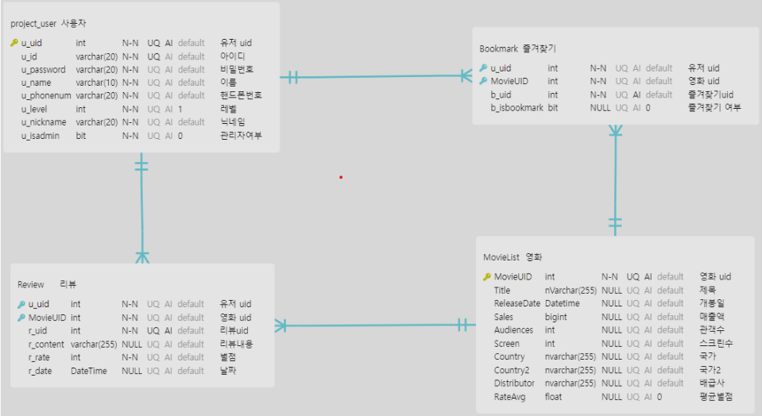
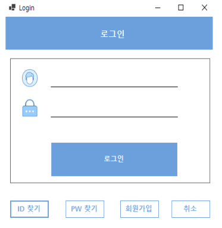
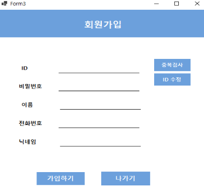
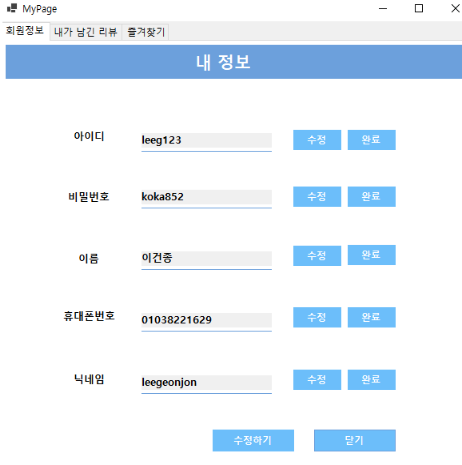
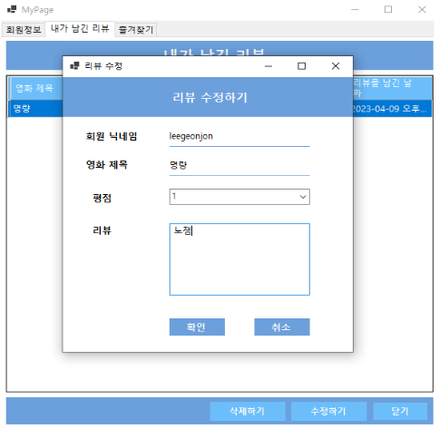

# **영화 리뷰 프로그램**

## **개요**
- 회원 CRUD , 영화리스트 CRUD 등을 통한 CRUD의 이해
- 영화진흥원 API 를 사용하여 API에 대한 이해 높이기
  

## **개발 환경 및 활용 기술**
- C# 및 .NET 프레임워크, Winform을 활용한 영화 리뷰사이트 화면 구현
- MSSQL 데이터베이스 구축
  
## **공헌한 내용**
- 참여도 50%
- ERD: ERD 설계
- 회원 CRUD : 회원 가입, 회원 탈퇴, 회원 상세보기, 회원 정보 수정, ID,PW찾기, 중복검사
- 마이페이지 : 댓글, 별점, 즐겨찾기 DB구현 후 마이페이지에서 확인 가능, 

- Json 파일로 데이터베이스 데이터 저장, 불러오기

[제작 시연 영상]

[제작 시연 영상]: https://www.youtube.com/watch?v=R2bu9cVhz_Q&list=PLedGoSru794_Yr2H12lOkCSZo3Y-VFaEk&index=3

ERD 설계

로그인 

회원가입

마이페이지(정보 수정)

마이페이지(리뷰관리)

